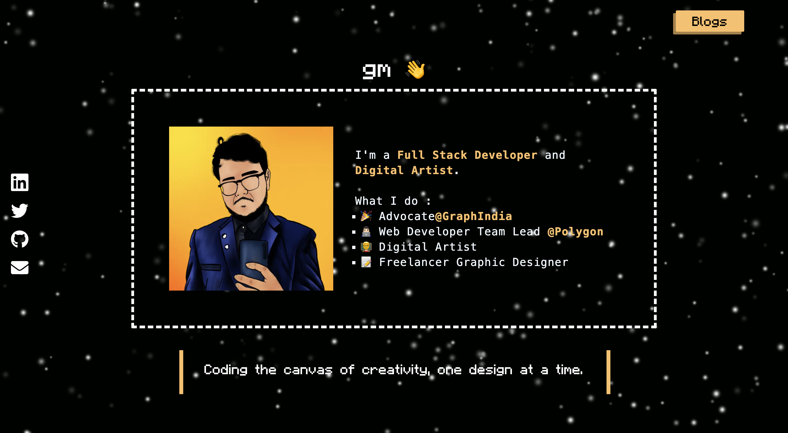

# Portfolio Website 🚀

<link href="globals.css" rel="stylesheet"></link>


<div align=''>

### [Demo](https://portfolio-template-1-0xayushM.vercel.app/) | [Video](https://youtu.be/PoDPFeEr_Lo)

</div>




This is an open-source template for creating a portfolio website. The template is designed to allow users to easily create their own portfolio websites by forking this repository and updating the data in `JSON` files.

## Technologies Used 🧑🏻‍💻


## Features ⭐️

- **Profile Section:** Display your personal information, such as name, job title, and a short bio.

- **Quote Section:** Showcase a motivational or inspirational quote that represents you.

- **Skills Section:** Highlight your skills and areas of expertise with icons.

- **Projects Section:** Showcase your projects with project names, descriptions, GitHub links, and more.

- **Work Experience Section:** Display your work experience and relevant details.

- **Image Carousel:** Use a carousel to showcase images or screenshots of your work.

- **Side Navbar:** A fixed side navbar with links to your social media profiles.

## Getting Started 🚀

1. **Fork the Repository:** Click the **Fork** button at the top right of this repository to create your own copy. Make sure to **Star ⭐️** the repo as well.

2. **Clone Your Repository:** Clone the forked repository to your local machine using Git.

   ```bash
   git clone https://github.com/your_username/portfolio-template-1.git
   ```

3. **Install Dependencies:** Navigate to the project folder and install the required dependencies.
   ```bash
   cd portfolio-template-1
   npm install
   ```
4. **Update data:** Modify the JSON files in the data directory to customize the content of your portfolio. To understand how to custom map <a href='#custom'>click here.</a>

5. **Run the development server:** Start the Next.js development server to see your changes in real-time.

   ```bash
   npm run dev
   ```

6. **Customize Styling:** Tailwind CSS is used for styling. Customize the styles in the `globals.css` directory to match your design preferences.

7. **Deployment:** Once you're satisfied with your portfolio, deploy it to platforms like Vercel, Netlify, or GitHub Pages.


<div id='custom'>

## Component-JSON Mapping 📊

Wondering how to tailor your portfolio's content? Let's demystify it with a groovy flow chart that links each component to its JSON buddy:

- **Profile Section**: Jazz it up in `profileData.json`
- **Quote Section**: Express yourself in `quoteData.json`
- **Skills Section**: Amp up skills in `skillsData.json`
- **Projects Section**: Showcase projects in `projectsData.json`
- **Work Experience Section**: Share experiences in `workExData.json`
- **Carousel**: Spotlight your images in `carouselData.json`
- **Side Navbar**: Connect on socials via `socialData.json`
- **Website details**: Change the title, description and icon of your portfolio in `websiteData.json`
- **Adding links**: Add links to a specific line in your `Profile section` or `Work experience` in their respective **json** files like this -

    ```json
    {
      "url": "link to redirect to",
      "bullet": "description"
    }
    ```

- **Highlight Word**: You can highlight specific words in a description in a json file like this - 

    Ex: 

    ```json
    {
        "content": "I'm a <highlight> Full Stack Developer </highlight> and <highlight> Digital Artist </highlight>."
    }
    ```

- **Highlight Color**: Change the color of the **highlighted content** in `globals.css`

     ``` css
      :root {
        --themeColor : #FBBF64;
        --hoverColor: #ffdfae;
        --boxShadow : #a98043;
        --hoverBoxShadow : #e1ae62;
        --themeColor2 : white;
        --themeTextColor : white;
        --themeTextColor2 : black;
        }
    ```
  Turn up your creative vibes by mixing and matching content with these JSON files. This modular approach makes customizing your portfolio a breeze.


</div>


## Contribute 🤝

👩‍💻 Contributions are welcome! Whether you're an experienced developer or just getting started, you can help improve this template. Here's how you can contribute:

- 🎛️ Fork the Repository
- 💽 Create a new branch for your feature or bug fix.

- ⚙️ Make your changes and commit them.
- 📡 Push your changes to your fork.

- 🌟 Submit a pull request to the main branch of this repository.

<hr>

### <p align="center">Built with ❤️ by [0xayushM](https://www.ayushmangal.com) 🚀</p>
